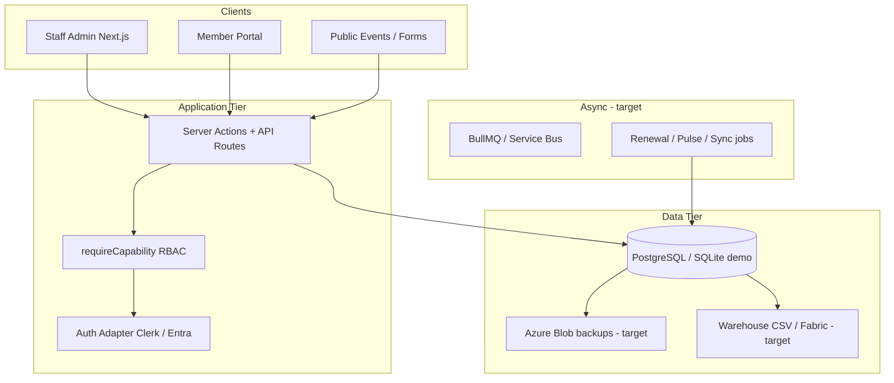

# PulsePoint Enterprise AMS — Architecture & Deliverables

**Audience:** Multi-agent engineering team, IT, association leadership  
**As of:** May 2026  
**Repo:** `/Users/jordanzabady/Desktop/pulse`

---

## 1. Recommended architecture



| Layer | Choice | Notes |
|-------|--------|-------|
| Frontend | Next.js 16 App Router | Server components + server actions |
| API | Server actions primary; REST for webhooks/public | API-first for future mobile |
| DB | Prisma ORM; Postgres production; SQLite local demo | Multi-tenant via `orgId` |
| Auth | Clerk (demo) → Entra ID (enterprise) | `lib/adapters/auth/` |
| Payments | Stripe adapter | Events + commerce |
| Email | Resend/SMTP → Azure Communication Services | Engage module |
| BI | CSV export → Power BI import; semantic layer roadmap | `pnpm continuity:export` |
| Hosting | Vercel/demo → Azure App Service / Container Apps | `Dockerfile` exists |

---

## 2. Domain model (core entities)

### Tenancy
- `Organization` — association tenant
- `User` + `OrgMembership` — staff RBAC (`OWNER` / `ADMIN` / `STAFF`)

### Membership & CRM
- `Member` — person; optional `organizationAccountId`
- `MemberOrganization` — hospital/health system; **parentId** hierarchy
- `MemberRole` — board, committee, executive (governance)
- `Committee` + `CommitteeMembership`
- `MemberRelationship`, `ContactSource`, `CrmWorkflow*`, `Deal*`
- `memberPulseData` — dimensional engagement JSON

### Advocacy
- `AdvocacyIssue`, `AdvocacyCampaign`

### Emergency
- `EmergencyContact`, `EmergencyReadinessReport`

### Education / revenue (alpha)
- `Course`, `CECreditAward`, `Event*`, `Commerce*`, `Donation`, `Email*`

### Platform
- `AuditLog`, `AutomationException`, `IntegrationConnection`

**Schema source:** `prisma/schema.prisma` (~65 models)

---

## 3. RBAC model

### Staff roles (coarse)
| Role | Typical use |
|------|-------------|
| OWNER | Full org control |
| ADMIN | Settings, imports, exports, emergency write |
| STAFF | Day-to-day CRM, events, advocacy read/write |

### Capabilities (fine-grained)
Extended list in `lib/permissions.ts` — includes `advocacy:*`, `emergency:*`, `committee:*`, `integrations:manage`, etc.

### Department defaults
`lib/association/rbac-matrix.ts` maps each of 16 departments → default capabilities for STAFF grants (future: `StaffDepartmentGrant` table).

---

## 4. Workflow diagrams (high level)

### Renewal
```
Member.tierId + renewalDueAt → RenewalWorkflow steps → email → commerce checkout → confirm
```

### Advocacy campaign
```
AdvocacyIssue → AdvocacyCampaign → Engage audience → EmailSendLog → MemberPulse advocacy dimension
```

### Emergency alert (foundation)
```
EmergencyContact roster → Engage sequence (planned) → readiness report filed
```

### Member onboarding
```
WebForm / CSV import → staged review → Member + MemberOrganization link → MemberPulse compute
```

---

## 5. API structure

| Surface | Pattern |
|---------|---------|
| Staff mutations | `app/actions/*.ts` + `requireCapability` |
| Webhooks | `app/api/webhooks/clerk`, `stripe` |
| Public | `app/[orgSlug]/e/*`, `app/api/crm/*` |
| Future REST | `/api/v1/*` behind Entra — not required for wedge |

**Contract:** JSON shapes documented in `docs/DATA-DICTIONARY.md`; warehouse export via `scripts/continuity/export-warehouse.ts`.

---

## 6. Tech stack (confirmed)

| Concern | Stack |
|---------|-------|
| Language | TypeScript |
| Framework | Next.js 16 |
| ORM | Prisma 7 |
| Auth | Clerk → Microsoft Entra |
| Payments | Stripe |
| Email | Resend / SMTP |
| Test | Vitest + Playwright |
| CI | GitHub Actions (`continuity.yml`, `e2e.yml`) |

---

## 7. Reporting framework

| Layer | Tool |
|-------|------|
| Operational | Insights snapshots, MemberPulse org dashboard |
| Executive | `/enterprise`, `/insights`, tier counts |
| Warehouse | `pnpm continuity:export` → CSV bundles |
| Self-service BI | Power BI (planned); Tableau (planned) |

---

## 8. Integration strategy

| Phase | Action |
|-------|--------|
| Now | `IntegrationConnection` registry + adapter stubs |
| Live | Stripe, Clerk, Resend |
| Next | Entra, Azure Postgres, Blob backups |
| Later | Salesforce, NetSuite, LMS, legislative feeds |

See `lib/association/integrations.ts` and `docs/ENTERPRISE-INTEGRATION.md`.

---

## 9. Data governance

| Rule | Enforcement |
|------|-------------|
| Tenant isolation | `getOrgDb`, `assertAllRowsBelongToOrg` |
| PII minimization | No PHI in MVP; classify in `docs/ad-ops/DATA-CLASSIFICATION.md` for ad ops |
| Audit | `AuditLog` on sensitive actions |
| Retention | Policy JSON on org (roadmap); backups per `BACKUP-REQUIREMENTS.md` |
| Export gate | `member:export` = ADMIN |

---

## 10. Example user journeys

| Persona | Journey |
|---------|---------|
| Association admin | Import members → assign hospital account → committee roster → MemberPulse review |
| Government affairs | Create AdvocacyIssue → campaign → Engage send → track participation |
| Emergency lead | Maintain EmergencyContact → readiness report → regional dashboard |
| CEO | `/insights` + `/enterprise` + MemberPulse champions |
| Finance | Commerce orders + integration to GL (roadmap) |

Personas: `lib/association/personas.ts`

---

## 11. Multi-year scalability

| Year | Focus |
|------|-------|
| Y1 | Wedge GA + MemberPulse + enterprise foundation + pilot on Postgres |
| Y2 | Advocacy/Emergency GA + warehouse pipeline + Entra |
| Y3 | Finance GL integration + LMS + AI insights (with governance) |

See `docs/REALIZATION-PLAN.md`.

---

## 12. Risks & mitigations

| Risk | Mitigation |
|------|------------|
| Scope creep (Protech parity) | `docs/SCOPE.md` wedge |
| Tenant leak | `pnpm leak:checks`, isolation audit |
| Backup gap | **Mandatory** `docs/BACKUP-REQUIREMENTS.md` |
| Dual RBAC (ad ops vs AMS) | Unify under org model before production ad ops |
| AI hallucination in policy | No AI-generated stats; SME review gate |

---

## 13. UX recommendations

- Department-first nav: `/enterprise` hub
- MemberPulse as default Members entry metric
- Persona-based landing pages (roadmap)
- WCAG 2.1 AA per `docs/UI-QUALITY-BAR.md`
- Plain-language errors + runbooks (`docs/RUNBOOK.md`)

---

## 14. Sample dashboards (implemented routes)

| Dashboard | URL |
|-----------|-----|
| Enterprise AMS | `/demo-healthcare/enterprise` |
| MemberPulse org | `/demo-healthcare/members/pulse` |
| Hospital accounts | `/demo-healthcare/enterprise/organizations` |
| Advocacy | `/demo-healthcare/enterprise/advocacy` |
| Emergency | `/demo-healthcare/enterprise/emergency` |
| Integrations | `/demo-healthcare/enterprise/integrations` |
| Insights KPIs | `/demo-healthcare/insights` |
