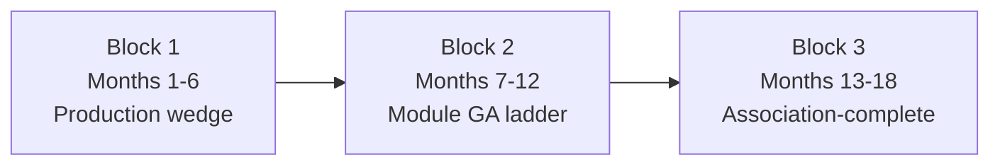

# PulsePoint — Realization plan (18 months)

**Audience:** Executive sponsor, engineering, operations  
**Purpose:** Define what “fully realize PulsePoint as a real AMS” means—without overselling or cloning Protech in one pass.  
**As of:** May 2026

PulsePoint already has the right foundation (multi-tenant data, staged imports, permissions, webhooks, honest Live/Roadmap). **“Fully realize”** means finishing the **unglamorous production layer** and graduating modules **one at a time**—not shipping every legacy edge case in one release.

This plan extends the repo’s existing 6-month unveil track ([GO-TO-MARKET-6MONTH.md](./GO-TO-MARKET-6MONTH.md)) into three six-month blocks. It aligns with [PROJECT-BRIEF.md](./PROJECT-BRIEF.md), [SCOPE.md](./SCOPE.md), [OPERATOR-CHECKLIST.md](./OPERATOR-CHECKLIST.md), and [PRODUCT-CLAIMS.md](./PRODUCT-CLAIMS.md).

**Enforceable standards:** [UI-QUALITY-BAR.md](./UI-QUALITY-BAR.md) · [SUPPORTABILITY-GATES.md](./SUPPORTABILITY-GATES.md)

---

## Strategic decision (locked)

**Optimize for Option A first:** *production-grade pilotable AMS*—not multi-customer SaaS company yet.

| | Option A (now) | Option B (later) |
|---|----------------|------------------|
| **Target** | One successful association pilot | Peer associations as paying customers |
| **When to shift** | After one successful pilot, renewal cycle, event season, import migration | — |
| **Block 3** | Portal, renewals, platform billing can stretch | Harder gates on GDPR, support ops, onboarding |

- [x] **Decision recorded:** Option A (May 2026)
- [ ] Evolve to Option B only after pilot success criteria in [pilot-feedback/](./pilot-feedback/)

---

## 0. What we are actually building: operational trust

The product is **not** “Members” or “Events” as boxes on a homepage.

> **PulsePoint = predictable behavior under association workflows.**

Legacy AMS survives because associations **trust it operationally**, not because staff love the UI. PulsePoint wins by being:

| Pillar | How we deliver it |
|--------|-------------------|
| **Operationally trustworthy** | Staged imports, audit history, exception queues, permission correctness, webhook recovery |
| **Visually modern** | [UI-QUALITY-BAR.md](./UI-QUALITY-BAR.md)—token-locked admin that stays consistent over time |
| **Intellectually honest** | Live / Alpha / Roadmap + `pnpm claims:validate`—features ship only after ops gates |

**Moat (invest here before new modules):**

- Import reconciliation
- Audit history (`AuditLog`)
- Exception queues (`AutomationException`)
- Permission correctness (`requireCapability`)
- Predictable exports (UI totals = CSV)
- Staff usability under stress (runbooks, explainable errors)

**#1 engineering investment:** end-to-end workflow reliability—Playwright smoke, import tests, payment tests, permission tests, cross-tenant tests. Associations forgive missing features if **imports, money, and permissions** are right; nothing else matters if those fail.

**Differentiator to market directly:**

> “PulsePoint only marks features **Live** when they pass operational readiness gates—not when a slide deck needs them.”

See [POSITIONING.md](./POSITIONING.md).

---

## 1. Define “real AMS” (three horizons)

| Horizon | What “done” means | Who it serves |
|---------|-------------------|---------------|
| **A — Production wedge** | MemberCore + Events + Work are **GA**: prod deploy, legal pages, runbook owners, Stripe drill, pilot on real (sanitized) data | First association pilot; leadership can claim **only** these modules |
| **B — Full modular suite** | Learn, Commerce, Giving, Engage, Insights each pass the **same go-live gates** as the wedge | “Full AMS” story vs Protech—modular, not monolithic |
| **C — Enterprise** | `INTEGRATION_PROFILE=hap-azure`: Entra, Azure Postgres, employer co-brand, optional employer marketing site | Employer integration—**separate decision** after A/B |

**Polish target:** Enforced via [UI-QUALITY-BAR.md](./UI-QUALITY-BAR.md)—not aspirational adjectives.

**Anti-goal:** Rebuilding 20 years of Protech edge cases (exhibits, chapter hierarchies, full GL) before the wedge is trusted. See [SCOPE.md](./SCOPE.md).

**Core insight:**

> Graduating modules **one at a time**—not shipping every Protech edge case in one pass—is how modern vertical SaaS beats incumbents.

---

## 1b. Block 1 GA wedge (narrow—hidden complexity kills pilots)

Block 1 success = staff are **proud** to run members + events + imports—not “we also have alpha modules.”

| **Included in GA (Block 1)** | **Explicitly deferred** |
|------------------------------|-------------------------|
| MemberCore (directory, notes, tags) | Learn, transcripts, CE engines |
| PulsePoint Events (publish, register, check-in, paid path) | Giving, segmentation engines |
| PulsePoint Work (admin shell, exceptions) | Insights board packets |
| Staged imports (stage → review → apply) | Committees / governance |
| Server-side permissions + audit | Renewals **automation** |
| Paid event registration (Stripe + runbook) | Portal expansion beyond preview |
| Operational exports (members, registrations, revenue CSV) | Custom report builders |

**Danger zone (state-space explosion):** transcripts, segmentation engines, renewal automation, committee governance—do not creep into Block 1.

**Block 1 bar:** MemberCore + Events feel **unbelievably clean**; imports painless; operations safe.

---

## 2. Current state vs target (honest gap)

Source of truth for 🟢/🟡/🔴: [OPERATOR-CHECKLIST.md](./OPERATOR-CHECKLIST.md).

| Area | Today | Target for “real” |
|------|-------|-------------------|
| **Core wedge** | Code 🟢; ops 🟡 | Prod URL, named runbook owners, one live Stripe path exercised |
| **Design** | Tokens + sidebar exist | [UI-QUALITY-BAR.md](./UI-QUALITY-BAR.md) pass on all wedge routes; mobile-friendly directory |
| **Operational trust** | Primitives exist 🟢; ops owners 🟡 | Named owners; drills exercised; supportability gates green for wedge |
| **Alpha modules** | Schema + admin + “quick add” | End-to-end workflows, exports, exceptions, member-facing pieces where needed |
| **Testing** | Unit + leak checks 🟢; Playwright not in CI 🟡 | E2E smoke on every merge for wedge paths |
| **Legal** | Subprocessors doc 🟡; privacy 🔴 | Counsel-approved privacy + terms before external users |
| **Member experience** | Public events 🟢; portal preview exists | Clerk-linked member portal (Phase 3 in README) |
| **Renewals** | Field on `Member`; automation roadmap | Renewal rules + staff workflow (or honest “roadmap” until shipped) |
| **Insights** | Alpha snapshots | Numbers match exports; board-ready packet |
| **Enterprise** | Documented only | Not required for “real AMS” unless enterprise Azure path chosen — [ENTERPRISE-INTEGRATION.md](./ENTERPRISE-INTEGRATION.md) |

---

## 3. North-star quality bar (every module, every PR)

Use this as the definition of **polished**—not “screens look done.”

### Engineering (non-negotiable — [SYSTEM-DESIGN.md](./SYSTEM-DESIGN.md), [ENGINEERING-INVARIANTS.md](./ENGINEERING-INVARIANTS.md))

- [ ] **Tenant:** every query via `getOrgDb(orgId)`; `pnpm leak:checks` stays green
- [ ] **Permissions:** `requireCapability()` on export, import apply, delete, money
- [ ] **State machines:** registration/event transitions explicit + tested
- [ ] **Async failures:** land in `AutomationException`, not silent success
- [ ] **Audit:** sensitive actions in `AuditLog`
- [ ] **Marketing truth:** `lib/products.ts` ↔ [PRODUCT-CLAIMS.md](./PRODUCT-CLAIMS.md) ↔ UI badges; `pnpm claims:validate` in CI

### Product polish (what users feel)

Enforced in [UI-QUALITY-BAR.md](./UI-QUALITY-BAR.md): layout, typography, color, interaction, forms, tables.

### Supportability (what ops feels under stress)

Required for every module GA—[SUPPORTABILITY-GATES.md](./SUPPORTABILITY-GATES.md): explainable failures, recoverability, operator visibility, export parity, human override, auditability.

### Ops polish (what IT/trust requires)

- [ ] Named owner per [RUNBOOK.md](./RUNBOOK.md) scenario
- [ ] [DEPLOY.md](./DEPLOY.md) production checklist signed once
- [ ] [SUBPROCESSORS.md](./SUBPROCESSORS.md) current
- [ ] Privacy policy live before public marketing push

---

## 4. Phased realization (18 months)

### Block 1 — Months 1–6: Real AMS wedge (unveil-ready)

**Goal:** One association can run members + events + staff ops in production without embarrassment.

#### Month 1–2 — Platform hardening + design cohesion

| Workstream | Deliverables | Done |
|------------|--------------|------|
| **Production** | Staging + prod on custom domain; Neon Postgres; Clerk + Stripe webhooks registered | [ ] |
| **Design pass** | [UI-QUALITY-BAR.md](./UI-QUALITY-BAR.md) audit on wedge routes; fix Overview, Members, Events, Member detail, Event form | [x] `docs/WEDGE-UI-AUDIT.md` (Sprint E) |
| **Onboarding** | First-run empty org: checklist on Home (add member → invite staff → create event → publish) | [x] `docs/PILOT-SETUP-CHECKLIST.md` |
| **Demo** | `pnpm db:seed:demo` + demo mode stable for leadership; GitHub Pages stays marketing-only | [ ] |
| **CI** | Playwright smoke: demo enter → members list → create event → public register (free) | [x] wedge spec expanded (Sprint E); paid register still staging |

#### Month 3 — Money path + migration confidence

| Workstream | Deliverables | Done |
|------------|--------------|------|
| **Stripe** | One paid event E2E on staging; [RUNBOOK.md](./RUNBOOK.md) #1 exercised with named owner | [ ] |
| **Import** | Real sanitized CSV through stage → review → apply; steward trained | [ ] |
| **Exceptions** | Force email failure; verify triage UX at `/{orgSlug}/exceptions` | [x] `docs/EXCEPTIONS-DRILL.md` |
| **Member profile** | Single member page: registrations, notes, tags—one screen story | [x] Summary tab one-screen (Sprint E1) |

#### Month 4–5 — Pilot + friction burn-down

| Workstream | Deliverables | Done |
|------------|--------------|------|
| **Pilot** | 3–5 testers matching [pilot profile](#pilot-profile); log in `docs/pilot-feedback/` | [ ] |
| **UX** | Top 10 friction fixes (search, filters, check-in, event publish flow) | [ ] |
| **Portal** | **Defer expansion**—keep preview-only with honest label unless pilot blocks on it | [ ] |
| **Legal** | Privacy + terms on site; subprocessors table reviewed | [ ] |

#### Month 6 — Unveil (supervisor / board)

| Deliverable | Gate | Done |
|-------------|------|------|
| 15-min scripted demo | Work → Members → Events → paid event → exceptions | [x] `docs/DEMO-SCRIPT-15MIN.md` |
| Operator checklist | No 🔴 for claimed modules; 🟡 have owners | [ ] |
| Comparison deck | PulsePoint vs legacy on cost, UX, honesty—not fake features | [ ] |
| Status flip | Only if gates pass: declare production wedge publicly | [ ] |

#### Block 1 exit criteria (“real AMS” minimum)

- [ ] `pnpm test` + `pnpm leak:checks` + `pnpm claims:validate` + E2E smoke green
- [ ] Prod deploy + webhook smoke signed ([DEPLOY.md](./DEPLOY.md))
- [ ] Counsel-approved privacy live
- [ ] Pilot completed; top issues fixed or documented in `docs/pilot-feedback/`
- [ ] `lib/products.ts`: `work`, `members`, `events` = `available` with no caveats in decks

**Month-by-month detail:** [GO-TO-MARKET-6MONTH.md](./GO-TO-MARKET-6MONTH.md) (Phases 0–6).

---

### Block 2 — Months 7–12: Graduate alpha → GA (modular full suite)

**Goal:** Each module is shippable, not a schema demo. Order matches revenue and staff pain (see [ROADMAP-MODULES.md](./ROADMAP-MODULES.md)):

| Order | Module | GA means (not “quick add”) | GA |
|-------|--------|----------------------------|-----|
| 1 | **Commerce** | Dues SKU, Stripe checkout, purchase on member profile, finance CSV export, reconciliation runbook | [ ] |
| 2 | **Learn** | Credit types, course enrollments, transcript on member, export for compliance | [ ] |
| 3 | **Engage** | Segments (tags + attendees), template approval, throttled send, unsubscribe/suppression | [ ] |
| 4 | **Giving** | Campaigns, gifts, acknowledgments, send log | [ ] |
| 5 | **Insights** | KPIs match DB; saved reports; CSV export = dashboard numbers; board packet once | [ ] |

#### Per-module playbook (repeat 5 times)

- [ ] **Spec** — Update `lib/roadmap-modules.ts` + acceptance checklist in [PRODUCT-CLAIMS.md](./PRODUCT-CLAIMS.md)
- [ ] **Workflows** — Staff happy path + edge cases + state machine
- [ ] **Member touchpoint** — Where members see it (portal or email only)
- [ ] **Security review** — Human review on money/email paths ([CONTRIBUTING.md](../CONTRIBUTING.md))
- [ ] **Runbook** — New exception workflows documented
- [ ] **Pilot task** — 1 persona test (finance, education coord, etc.)
- [ ] **Supportability** — [SUPPORTABILITY-GATES.md](./SUPPORTABILITY-GATES.md) checklist green
- [ ] **Flip status** — `lib/products.ts` → `available`; marketing badges → Live; `pnpm claims:validate`

**Block 2 polish theme:** Module pages should feel like MemberCore/Events quality—not placeholder grids.

#### Reporting (do not become a second product)

| Phase | Scope | When |
|-------|--------|------|
| **1 — Operational exports** | Members, registrations, revenue CSV; totals match UI | Block 1 |
| **2 — Saved filtered views** | Named filters staff reuse | Block 2 (per module) |
| **3 — Board packets / KPIs** | Insights GA: snapshot + export parity | Block 2 end / Block 3 |

**Avoid until much later:** custom report builders, drag/drop analytics, multidimensional slicing.

---

### Block 3 — Months 13–18: Association-complete + optional enterprise

| Workstream | Deliverables | Done |
|------------|--------------|------|
| **Member portal** | Authenticated members: profile, registrations, purchases, transcript (per module GA) | [ ] |
| **Renewals** | Renewal due dates, staff renewal report, optional Stripe renewal (or manual workflow + honest docs) | [ ] |
| **Committees** | MVP: committees, rosters, basic terms (pillar today is coming_soon) | [ ] |
| **GDPR-lite** | Documented DSAR process; export/delete runbook (full automation optional later) | [ ] |
| **Postgres RLS** | Second tenant boundary in DB ([ISOLATION-AUDIT.md](./ISOLATION-AUDIT.md)) | [ ] |
| **hap-azure** | Only if sponsored: Entra, Azure PG, `themes/hap-enterprise.css`, IT discovery | [ ] |

#### Block 3 exit criteria (“full AMS” story)

- [ ] All products in `PULSE_PRODUCTS` either `available` or explicitly `coming_soon` with no “alpha forever”
- [ ] Member portal live for pilot org
- [ ] [OPERATOR-CHECKLIST.md](./OPERATOR-CHECKLIST.md) green for all claimed modules
- [ ] Option B: first external paying customer (only after pilot success criteria)

---

### Pilot profile {#pilot-profile}

**Do not** pick: largest org, most political org, heaviest legacy customization.

| Attribute | Why |
|-----------|-----|
| Medium complexity | Realistic without chaos |
| Cooperative staff | Faster iteration |
| Event-heavy | Visible value quickly |
| Spreadsheet pain today | Imports shine |
| No massive GL / accounting edge cases | Avoid finance traps |

First success story &gt; breadth. Scripts: [pilot-feedback/README.md](./pilot-feedback/README.md).

---

## 5. Cross-cutting workstreams (parallel, all 18 months)

### A. Design system (“neat and clean”)

Governed by [UI-QUALITY-BAR.md](./UI-QUALITY-BAR.md).

| Sprint | Actions | Done |
|--------|---------|------|
| **Token lock** | Freeze `--pc-*` tokens; ban one-off hex in admin | [ ] |
| **Component library** | Extract repeated patterns: data table, filter bar, stat grid, form sections | [ ] |
| **Marketing ↔ admin** | Same typography scale; marketing hero navy matches admin chrome | [ ] |
| **Mobile** | Members directory + event check-in usable on tablet/phone | [ ] |
| **Motion** | Subtle hovers only; `prefers-reduced-motion` respected | [ ] |

### B. Engineering quality (over-invest in E2E)

| Item | Target | Done |
|------|--------|------|
| **E2E in CI** | **Top priority:** wedge paths on every PR—imports, payments, permissions, demo enter | [ ] |
| **Performance budget** | Member list &lt;200ms perceived with 500 rows | [ ] |
| **Sentry** | After pilot traffic, not day one | [ ] |
| **Security** | `pnpm security:audit` + quarterly manual webhook review | [ ] |
| **Docs** | [DATA-DICTIONARY.md](./DATA-DICTIONARY.md) synced with Prisma | [ ] |

### C. Operations & trust (assign names)

| Item | Owner |
|------|-------|
| Stripe paid / DB pending | ________________ |
| Import mistakes | ________________ (data steward / ADMIN) |
| Email failures | ________________ (app support) |
| Privacy questionnaires | ________________ (IT liaison + counsel) |

### D. Go-to-market honesty

- [ ] Never advance [PRODUCT-CLAIMS.md](./PRODUCT-CLAIMS.md) before code
- [ ] Grant decks checked against checklist before send
- [ ] Alpha modules stay Alpha badges in admin sidebar until GA gate

---

## 6. What to cut or defer (scope discipline)

Say **no** to these until Block 1 is green:

- Protech parity: complex sponsorships, exhibit halls, multi-chapter billing trees
- Power BI embed (semantic layer first, embed when IT ready)
- Full automated GDPR DSAR portal
- Enterprise production SSO / employer marketing site embed
- Rebuilding auth without Clerk unless security review demands it

See [SCOPE.md](./SCOPE.md) and [SELECT-STAR-DEBT.md](./SELECT-STAR-DEBT.md).

---

## 7. Resource model (solo vs team)

| Mode | Block 1 | Block 2 | Block 3 |
|------|---------|---------|---------|
| **Solo** | ~6 months realistic for wedge GA | +12 months for 5 modules sequential | Portal + committees stretch to ~24mo |
| **+1 engineer** | ~4 months wedge | ~6–8 months module GA | ~12 months to “full suite” |
| **+design contractor** | 2-week token + admin audit accelerates polish perception | — | — |

**Infra cost (unveil scale):** ~$40–65/mo per [FREE-STACK.md](./FREE-STACK.md) (domain, Vercel, Neon, Resend free tier, Stripe fees on live volume only).

---

## 8. Success metrics (measurable polish)

| Metric | Target |
|--------|--------|
| Task: add member | &lt; 60s |
| Task: publish event + get public link | &lt; 3 min |
| Task: find member + add note | &lt; 30s |
| Pilot SUS / verbatim | “Easier than [legacy]” from 3+ testers |
| Incidents | Zero cross-tenant leaks; Stripe drift resolved via runbook |
| Claims drift | `pnpm claims:validate` always green |
| Module GA | Each module: checklist green before status flip in `lib/products.ts` |

---

## 9. First 30 days (week-by-week)

Aligned with [OPERATOR-CHECKLIST.md](./OPERATOR-CHECKLIST.md). **No new modules** until Week 4 review passes.

### Week 1

- [ ] Lock [UI-QUALITY-BAR.md](./UI-QUALITY-BAR.md); use PR checklist
- [ ] Playwright smoke in GitHub Actions (demo enter → members → event → public register)
- [ ] Name **runbook owners** (Stripe, imports, email)

### Week 2

- [ ] Stripe staging drill (paid registration E2E)
- [ ] Import reconciliation drill (sanitized CSV → stage → review → apply)
- [ ] Exception UX review (`/{orgSlug}/exceptions`)

### Week 3

- [x] Member detail screen polish (one-screen story)
- [x] Event publish flow polish
- [ ] Mobile/tablet admin pass (directory + check-in)

### Week 4

- [ ] Pilot scripts + recruit testers ([pilot profile](#pilot-profile))
- [ ] Legal review (privacy + [SUBPROCESSORS.md](./SUBPROCESSORS.md))
- [ ] Production readiness review ([DEPLOY.md](./DEPLOY.md) + [SUPPORTABILITY-GATES.md](./SUPPORTABILITY-GATES.md) for wedge)

**After Week 4 only if gates pass:** new modules, portal expansion, enterprise work.

Also: [ ] Domain → staging URL (pulsepointams.com or chosen)

---

## 10. Summary

| Phase | Outcome |
|-------|---------|
| **Now → Month 6** | Production-grade **wedge** — polished admin UX, prod deploy, legal, pilot, honest unveil |
| **Month 7–12** | **Module GA ladder** — Commerce → Learn → Engage → Giving → Insights, each with full workflows |
| **Month 13–18** | **Association-complete** — portal, renewals, committees; optional enterprise Azure |

**Full AMS ≠ all features on day one.** It means: **operational trust**, consistent UX, ops that don’t lie, and modules promoted only when supportability + claims checklists are green.

**Remaining work is mostly linear:** operational hardening, UX consistency, workflow completion, supportability, trust accumulation—not existential redesign.

---

## Related documents

| Document | Role in this plan |
|----------|-------------------|
| [UI-QUALITY-BAR.md](./UI-QUALITY-BAR.md) | Enforceable admin UI rules |
| [SUPPORTABILITY-GATES.md](./SUPPORTABILITY-GATES.md) | Module GA operability checklist |
| [PROJECT-BRIEF.md](./PROJECT-BRIEF.md) | Leadership narrative |
| [OPERATOR-CHECKLIST.md](./OPERATOR-CHECKLIST.md) | 🟢/🟡/🔴 status + go-live gates |
| [GO-TO-MARKET-6MONTH.md](./GO-TO-MARKET-6MONTH.md) | Month 1–6 execution detail |
| [SCOPE.md](./SCOPE.md) | Wedge vs Protech; expansion gates |
| [PRODUCT-CLAIMS.md](./PRODUCT-CLAIMS.md) | Public claims registry |
| [ROADMAP-MODULES.md](./ROADMAP-MODULES.md) | Alpha module specs |
| [RUNBOOK.md](./RUNBOOK.md) | Incident playbooks |
| [DEPLOY.md](./DEPLOY.md) | Production deploy + smoke |
| [SYSTEM-DESIGN.md](./SYSTEM-DESIGN.md) | Engineering invariants |
| [ENTERPRISE-INTEGRATION.md](./ENTERPRISE-INTEGRATION.md) | Horizon C (hap-azure) |

**Commands:** `pnpm test` · `pnpm leak:checks` · `pnpm claims:validate` · `pnpm security:audit`

**Last updated:** May 2026
